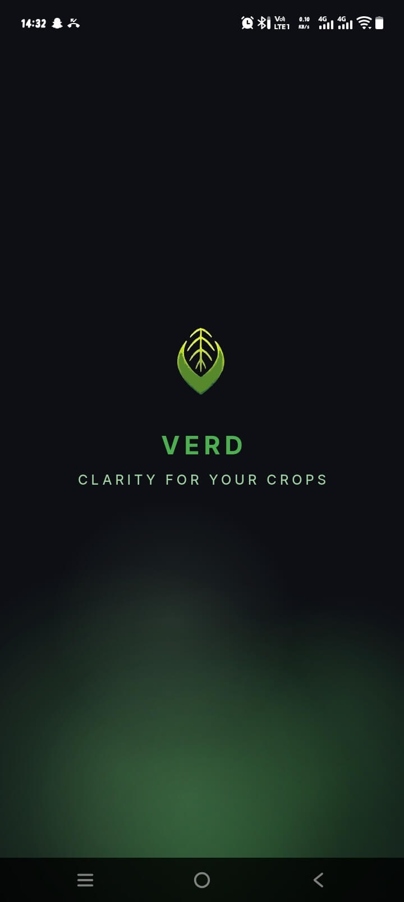
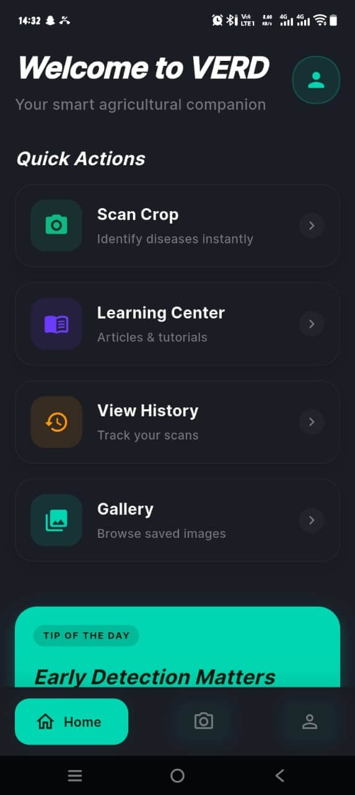

# 🌿 Verd

A Flutter mobile application that uses AI-powered image recognition to detect plant and vegetable diseases in real-time. **Verd** helps farmers, gardeners, and agricultural enthusiasts quickly identify crop health issues using their device's camera or image gallery.

## ✨ Features

- **📸 AI-Powered Disease Detection**: Scan plant leaves to identify diseases using both offline TensorFlow Lite models and Google Generative AI (Gemini) for enhanced accuracy
- **🔄 Offline-First Architecture**: TFLite models work without internet connection for quick scans
- **💳 Free Trial**: Get 3 free scans before signing up
- **🔐 Secure Authentication**: Sign in with Google or email/password via Firebase
- **📚 Learning Center**: Access location-based articles and pest management resources
- **🌍 Localization**: Multi-language support with Flutter i18n
- **⚙️ Persistent Settings**: Save preferences locally with Hive database
- **📱 Cross-Platform**: Runs on Android, iOS, Web, Linux, macOS, and Windows
- **🔔 Push Notifications**: Get notified about weather alerts and crop updates via Firebase Cloud Messaging
- **💬 Chat & Support**: Contact support team directly within the app

## 📸 Screenshots

| Splash Screen | Home Dashboard |
|---|---|
|  |  |

*"Clarity for your crops" - Your smart agricultural companion*

## 🛠️ Tech Stack

### Frontend
- **Framework**: Flutter 3.11+
- **State Management**: Riverpod 3.2.1
- **Navigation**: GoRouter 17.1.0
- **UI Components**: Material Design 3

### Backend & Services
- **Authentication**: Firebase Auth with Google Sign-In
- **Database**: Cloud Firestore for cloud data, Hive for local caching
- **Storage**: Firebase Storage for image uploads
- **AI/ML**: 
  - TensorFlow Lite for offline plant disease classification
  - Google Generative AI (Gemini) for advanced analysis
- **Analytics**: Firebase Analytics & Crashlytics
- **Notifications**: Firebase Cloud Messaging (FCM)
- **Security**: Firebase App Check

### Utilities
- **Camera**: Flutter Camera plugin for real-time capture
- **Image Processing**: Image manipulation & MIME type detection
- **Networking**: Dio for HTTP requests
- **Localization**: flutter_localizations + intl
- **Storage**: SharedPreferences for simple local storage
- **Permissions**: permission_handler for runtime permissions
- **Connectivity**: connectivity_plus for network state monitoring

## 📋 Prerequisites

- Flutter SDK 3.11+
- Dart 3.11+
- Android SDK 21+ / iOS 14+
- Firebase Project (with Firestore, Storage, Auth, and Messaging enabled)
- Google Cloud credentials for Google Sign-In
- TensorFlow Lite model files (in `assets/models/`)

## 🚀 Getting Started

### 1. Clone the Repository
```bash
git clone https://github.com/Benjaminofili/Verd.git
cd Verd
```

### 2. Install Dependencies
```bash
flutter pub get
```

### 3. Set Up Environment Variables
Create a `.env` file in the project root with your Firebase and API credentials:
```
FIREBASE_API_KEY=your_firebase_api_key
GOOGLE_SIGN_IN_CLIENT_ID=your_google_client_id
GEMINI_API_KEY=your_gemini_api_key
```

### 4. Generate Code (Localization & Riverpod)
```bash
flutter pub run build_runner build
```

### 5. Configure Firebase
- Download `google-services.json` (Android) from Firebase Console
- Download `GoogleService-Info.plist` (iOS) from Firebase Console
- Place them in the appropriate directories

### 6. Run the App
```bash
flutter run
```

### For Specific Platforms:
- **Android**: `flutter run -d android`
- **iOS**: `flutter run -d ios`
- **Web**: `flutter run -d web`

## 📁 Project Structure

```
lib/
├── models/              # Data models
├── providers/           # Riverpod state management
├── screens/             # UI screens (scan, learning center, settings, etc.)
├── widgets/             # Reusable UI components
├── services/            # Business logic (auth, ML inference, API calls)
├── l10n/                # Localization files (ARB)
├── constants/           # App-wide constants
└── main.dart            # App entry point

assets/
├── images/              # UI images and icons
├── models/              # TensorFlow Lite model files
└── fonts/               # Custom fonts (Inter, SF Pro)
```

## 🔄 How It Works

1. **Camera Capture**: User opens the scan screen and grants camera permission
2. **Image Processing**: Selected/captured image is processed for inference
3. **Offline Detection**: TFLite model runs locally for quick results
4. **Cloud Analysis** (Optional): Image can be sent to Gemini API for detailed analysis
5. **Results Display**: Disease prediction, confidence score, and remediation tips shown
6. **Data Persistence**: Results saved locally and to Firestore for logged-in users

## 📊 API Endpoints

- **Firebase Firestore**: Real-time database for scan history and user data
- **Google Generative AI**: Gemini API for advanced plant analysis
- **Firebase Storage**: Store scan images securely

## 🔐 Authentication Flow

1. User opens app → sees onboarding or login screen
2. Can scan up to 3 times for free (tracked locally)
3. After limit reached → signup prompt appears
4. Sign in with Google or email/password
5. Unlocked: unlimited scans, scan history, personalized learning center

## 🧪 Testing

Run unit tests:
```bash
flutter test
```

Run integration tests:
```bash
flutter drive --target=test_driver/app.dart
```

## 📝 Roadmap

- [x] Camera permission delayed until scan page
- [x] App icon customization
- [x] Chat and support screen
- [x] Free trial (3 scans) system
- [ ] Location-based learning center articles
- [ ] Advanced TensorFlow Lite model integration
- [ ] Offline ML model updates
- [ ] Social sharing of scan results
- [ ] Multi-language support expansion

See [TODO.txt](./TODO.txt) for detailed implementation notes.

## 📄 License

This project is licensed under the MIT License - see [LICENSE](./LICENSE) for details.

## 🤝 Contributing

Contributions are welcome! Please feel free to submit a Pull Request.

1. Fork the repository
2. Create your feature branch (`git checkout -b feature/AmazingFeature`)
3. Commit your changes (`git commit -m 'Add some AmazingFeature'`)
4. Push to the branch (`git push origin feature/AmazingFeature`)
5. Open a Pull Request

## 💬 Support

For issues, questions, or feature requests, please:
- Open an issue on GitHub
- Use the in-app chat/support feature
- Contact via email (available in the app)

## 🌱 About

Verd is built with the vision of making agricultural disease detection accessible to everyone, from small-scale farmers to home gardeners. By leveraging mobile AI technology, we aim to reduce crop loss and improve food security.

---

**Made with ❤️ by Benjamin**
