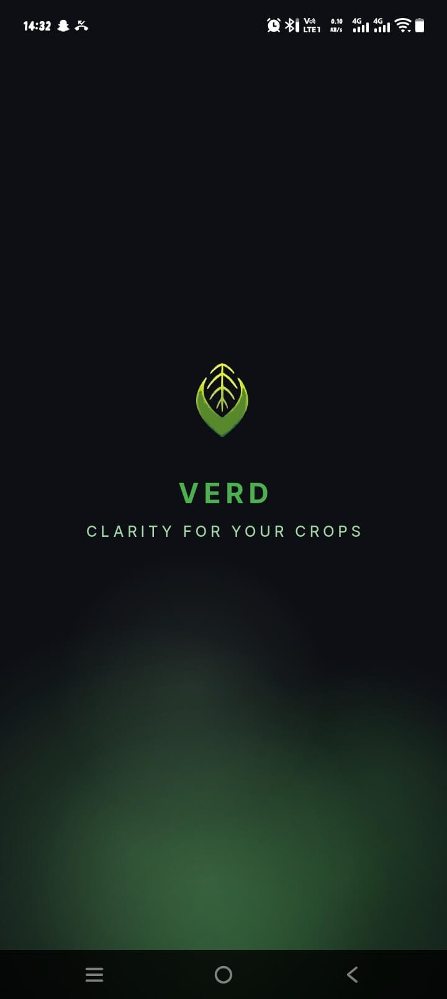
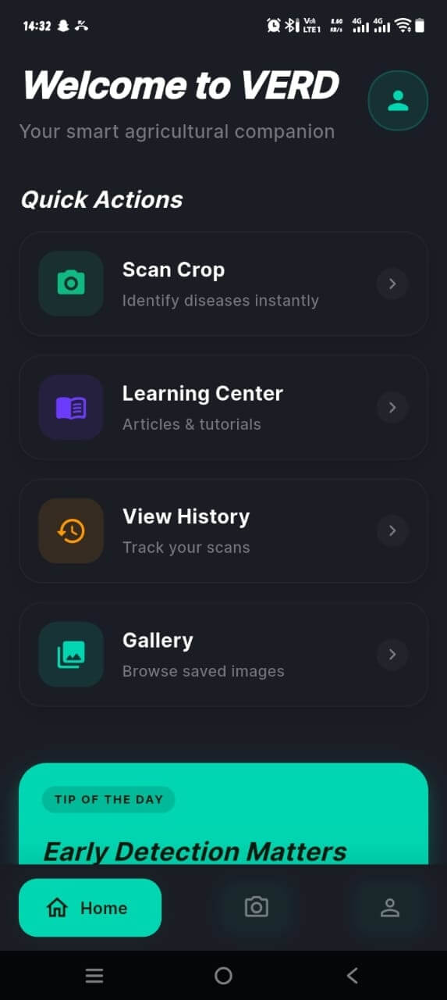

# 🌿 Verd

A Flutter mobile app that detects plant and vegetable diseases from a photo. **Verd** helps farmers, gardeners, and agricultural enthusiasts identify crop health issues using their device's camera or gallery, with results that work even offline.

> **AgriScan AI Hackathon Finalist**  
> Verd was developed collaboratively as a team hackathon project. This repository is Benjamin Ofili's personal portfolio copy of the team's latest codebase.

## 📸 Screenshots

| Splash Screen | Home Dashboard |
|---|---|
|  |  |

*"Clarity for your crops" — your smart agricultural companion*

## ✨ Features

- **Hybrid AI disease detection** — when online, the scan is uploaded and analyzed by Google's Gemini API for the most accurate read; when offline (or if the cloud call fails), it falls back to an on-device TensorFlow Lite model so scanning still works with no connection
- **Grad-CAM explainability** — integrated alongside the on-device model to provide a visual explanation of model predictions
- **Free trial** — guests get 3 scans (tracked locally) before being prompted to create an account
- **Firebase Auth** — email/password and Google Sign-In
- **Scan history** — results sync to Cloud Firestore for signed-in users; Hive handles local caching and offline-first storage
- **Learning Center** — crop disease knowledge base and articles
- **Push notifications** — Firebase Cloud Messaging with deep-link navigation to the relevant screen
- **Localization** — UI translated into 13 languages (see `lib/l10n/`)
- **Cross-platform Flutter project** — Android and iOS are the actively developed targets; Web/Linux/macOS/Windows scaffolding is present from `flutter create` but not the focus of testing

## 🛠️ Tech Stack

| Layer | Technology |
|---|---|
| Framework | Flutter (Dart) |
| State management | Riverpod |
| Routing | GoRouter |
| Backend | Firebase — Auth, Firestore, Storage, Cloud Messaging, Analytics, Crashlytics, App Check |
| Local storage | Hive, SharedPreferences |
| AI / ML | Google Gemini API (online) + TensorFlow Lite via `tflite_flutter` (offline fallback) + Grad-CAM explainability |

## How it works — AI routing

The scan flow is driven by a routing service in `lib/data/services/ai_service.dart`:

1. If the device is online: the photo is uploaded to Firebase Storage and sent to Gemini for analysis; the completed result is saved to Firestore.
2. If offline, or the cloud call fails: the app falls back to the local TFLite model and returns an offline-compatible result payload.

This keeps scanning functional in low-connectivity conditions, which matters for a field/agricultural use case.

## Team & Role

Verd was developed as a team project for the **AgriScan AI Hackathon**, where the project reached the finals.

**Benjamin Ofili — Lead Mobile Developer**

- Led the Flutter mobile application implementation and frontend work
- Worked on backend and service integration for the mobile application
- Integrated the pretrained machine-learning model into the Flutter app
- Integrated Grad-CAM explainability into the mobile experience
- Contributed to the technical implementation throughout the hackathon

The underlying machine-learning model was **not trained by Benjamin**; his contribution focused on mobile development, service integration, and model integration.

## Project Structure

```
lib/
├── core/       # App-wide constants, router, theme, localization, providers
├── data/       # Models, repositories, services (AI routing, Firebase, local ML, storage)
├── features/   # Screen-level UI grouped by feature (scan, auth, profile, learning, ...)
├── providers/  # Riverpod providers for app services and state
└── shared/     # Reusable widgets and UI building blocks

assets/
└── models/     # TensorFlow Lite model files
```

## Getting Started

### Prerequisites
- Flutter SDK (Dart 3+)
- A configured Firebase project (Auth, Firestore, Storage, Messaging) with platform config files added
- A Gemini API key

### Setup

```bash
git clone https://github.com/Benjaminofili/Verd.git
cd Verd
flutter pub get
```

Create a `.env` file in the project root:

```env
GEMINI_API_KEY=your_gemini_api_key_here
```

The app loads this at startup from `main.dart`. Then add your Firebase config:
- `lib/firebase_options.dart`
- `google-services.json` (Android) / `GoogleService-Info.plist` (iOS)

Regenerate generated code if needed (localization, Riverpod, etc.):

```bash
dart run build_runner build --delete-conflicting-outputs
```

Run the app:

```bash
flutter run            # defaults to a connected device/emulator
flutter run -d android
flutter run -d ios
```

## Testing

```bash
flutter test
```

Tests live under `test/`: `test/tflite_test.dart` (on-device model), `test/data/services/` (AI routing and Firebase-backed services), `test/localization/`, and `test/widget_test.dart`.

## Useful Commands

```bash
flutter analyze                                          # static analysis / lint
dart run build_runner build --delete-conflicting-outputs # regenerate localization/Riverpod code
```

## Roadmap

See [TODO.txt](./TODO.txt) for the working list of in-progress and planned items (location-based learning content, expanded offline model coverage, and further UI refinement).

## License

MIT — see [LICENSE](./LICENSE).

## Contributing

1. Create a feature branch
2. Make focused changes, with tests where practical
3. Run `flutter analyze` and `flutter test`
4. Open a pull request with a clear summary

## About

Verd aims to make plant disease detection accessible to farmers and gardeners of any scale, using mobile AI to help catch crop problems earlier and reduce loss.
